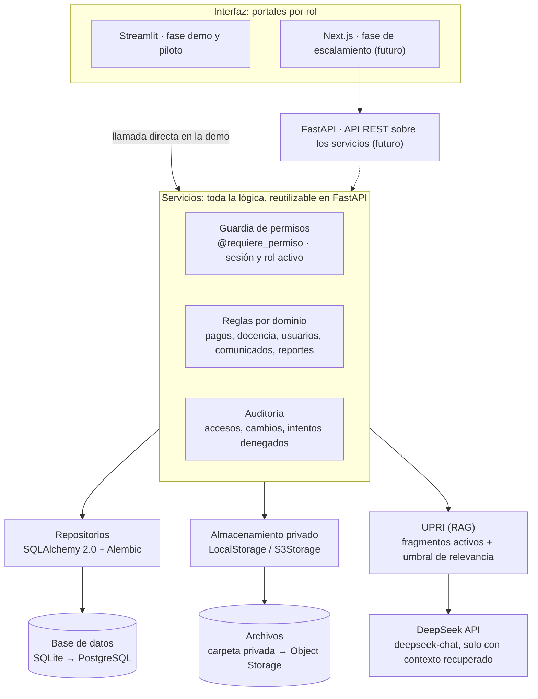
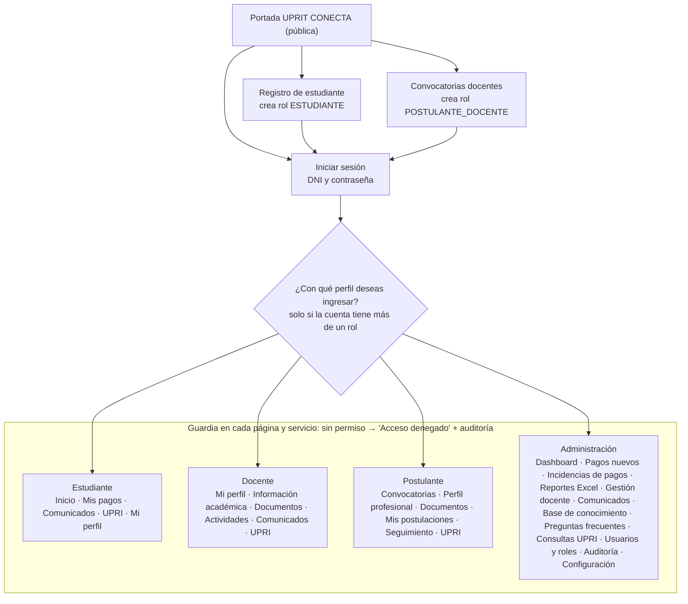

# UPRIT CONECTA — Documento de diseño (v1)

3 de octubre de 2026 · Estado: pendiente de aprobación

> Vista previa en VS Code: `Ctrl+Shift+V`. Para ver los diagramas instala la extensión **Markdown Preview Mermaid Support** (bierner.markdown-mermaid).

## 0. Diagnóstico del proyecto existente

La versión actual (commit "Primera versión funcional") se evolucionará, no se reescribirá desde cero: la estructura académica ya está bien modelada y la base contiene datos reales que deben conservarse. Lo que sí cambia es la seguridad (rol único), la organización del código y la forma de guardar archivos.

| Hallazgo en el RAR | Impacto | Decisión |
| --- | --- | --- |
| Jerarquía niveles → unidades → programas: 3 niveles, 9 unidades, 47 programas (18 pregrado, 20 maestrías, 3 doctorados, 6 segundas especialidades), coincide con la lista oficial | Ninguno | Conservar tal cual |
| Tablas antiguas `facultades` (3) y `escuelas` (5) con nombres que no coinciden con los oficiales ("Facultad de Ingeniería", "Facultad de Derecho y Humanidades") y que aún referencian usuarios, comunicados, documentos, FAQ y calendario | Datos académicos duplicados e inconsistentes | Mapear a la nueva jerarquía y dejarlas como solo lectura |
| `usuarios.rol` con un único valor (`administrador` / `usuario`) | No permite varios roles ni RBAC | Migrar a `roles` + `usuario_roles` |
| `app.py` monolítico de 549 líneas; el registro público crea cuentas genéricas | Difícil de escalar y de auditar | Modularizar en capas y páginas |
| `preguntas_frecuentes.respuesta` es NOT NULL (vacía en las 8 preguntas) | Contradice "respuestas no hardcodeadas" | Columna heredada sin uso; no se elimina |
| Rutas absolutas de Windows (`C:\Users\ENRIQUE\Desktop\...`) guardadas en `fuentes_conocimiento` y `documentos` | Se rompe al cambiar de equipo o servidor | Convertir a claves relativas de almacenamiento |
| `pagos_voucher` sin registros; ya genera `PAGO-AAAA-NNNNNN` | Bajo | Migrar a la tabla `pagos` definitiva |
| 4 imágenes JPG en `documentos/` registradas como "información sobre pagos" en la tabla `documentos` | Origen ambiguo | Confirmar si son material de conocimiento |
| `rag.py` llegó vacío (0 bytes) en el RAR y no está en git; tampoco lo están `chatbot.py` ni `procesador_documentos.py` | Se pierde la lógica de recuperación actual | Reenviar `rag.py` y hacer commit |
| `requirements.txt` usa XlsxWriter | El requisito pide openpyxl | Cambiar a openpyxl |
| Auditoría (37 registros) y conversaciones/consultas de IA con datos | Historial valioso | Conservar |

**Riesgo de seguridad inmediato:** el RAR incluye `.streamlit/secrets.toml` con una API key de DeepSeek real. No está en git, pero `.gitignore` no lo excluye y el archivo ya circuló al compartir el RAR. Recomiendo regenerar la clave en DeepSeek y añadir `.streamlit/secrets.toml` al `.gitignore` antes de cualquier commit.

## A. Arquitectura propuesta

Una sola aplicación con cuatro capas: interfaz Streamlit delgada, servicios con toda la lógica y los permisos, repositorios de datos y adaptadores externos. La interfaz nunca toca la base de datos ni los archivos directamente; así, al migrar a FastAPI + Next.js, los servicios se reutilizan casi intactos y solo se reemplaza la capa de interfaz.

| Capa | Responsabilidad | Tecnología demo | Tecnología producción |
| --- | --- | --- | --- |
| Interfaz (portales) | Páginas por rol, componentes visuales, formularios | Streamlit (`st.navigation`, una URL por página) | Next.js |
| Servicios | Reglas de negocio, validaciones, verificación de permisos, auditoría | Python puro | Los mismos módulos detrás de FastAPI |
| Repositorios | Consultas y transacciones | SQLAlchemy 2.0 Core + Alembic | Igual |
| Datos | Tablas y metadatos | SQLite | PostgreSQL (+ pgvector opcional) |
| Archivos | Vouchers, CV, documentos | Carpeta local privada fuera de `assets/` | Object Storage privado compatible con S3 |
| IA | UPRI: recuperación + generación | Búsqueda BM25 sobre fragmentos + DeepSeek (`deepseek-chat`) | Recuperación híbrida (BM25 + vectores) + DeepSeek |



Al pasar a FastAPI + Next.js se reemplaza solo la franja superior; servicios, repositorios, almacenamiento y UPRI siguen siendo los mismos módulos.

**Por qué los permisos son "de backend" aun en Streamlit.** Streamlit ejecuta todo en el servidor, pero cualquier página es alcanzable por URL. Por eso cada función de servicio exige el usuario y verifica el permiso con un decorador `@requiere_permiso("pagos.validar")`, y cada página llama a un guardia al inicio que, si falla, muestra "Acceso denegado. Tu cuenta no tiene permisos para acceder a este módulo." y registra el intento en auditoría. Ocultar un botón es solo comodidad visual; la barrera real está en el servicio.

**Sesiones.** `st.session_state` guarda solo el id de sesión, el usuario y el rol activo. En cada carga se revalida contra la tabla `sesiones` (expiración, revocación, usuario activo), de modo que desactivar a un usuario o quitarle un rol surte efecto de inmediato.

**Portabilidad SQLite → PostgreSQL.** Nada de SQL específico de SQLite en el código: tipos SQLAlchemy estándar, fechas como `DateTime` con zona horaria, montos como `Numeric(10,2)` (no `REAL`), migraciones con Alembic y la cadena de conexión en `DATABASE_URL`. Pasar a PostgreSQL es cambiar esa variable y ejecutar el script de copia de datos.

**UPRI (RAG).** Pregunta → filtro por alcance del usuario (nivel, unidad, programa, rol) → recuperación de fragmentos activos → umbral mínimo de relevancia → prompt a DeepSeek con solo esos fragmentos → respuesta con fuentes. Si no se supera el umbral, no se llama al modelo y se devuelve el mensaje institucional de "información insuficiente". DeepSeek no ofrece API de embeddings, por eso la demo usa BM25 y la búsqueda vectorial queda detrás de una interfaz `Recuperador` para añadirla después.

**Evolución prevista:** demo gratuita (Streamlit + SQLite) → piloto institucional (PostgreSQL gestionado, almacenamiento privado) → VPS con Nginx y HTTPS → FastAPI + Next.js reutilizando `services/` → uso masivo (Redis para caché y colas de procesamiento de documentos).

## B. Estructura de carpetas

Respeta la estructura que propusiste y añade cuatro piezas para que escale: `core/` (configuración, seguridad, sesión), `repositories/` (acceso a datos), `pages/` (una página por pantalla, con URL propia) y `migrations/` (Alembic). `modules/` queda como la capa visual de cada portal.

```
UPRIT_CONECTA/
├── app.py                      # punto de entrada: tema, sesión, st.navigation por rol
├── database.py                 # motor SQLAlchemy desde DATABASE_URL (sin SQL de SQLite)
├── config/
│   ├── settings.py             # lee secrets.toml / variables de entorno
│   ├── permisos.py             # catálogo de permisos y matriz rol → permisos
│   └── catalogos.py            # conceptos de pago, medios, estados (semilla)
├── core/
│   ├── seguridad.py            # bcrypt, política de contraseñas, bloqueo por intentos
│   ├── sesion.py               # crear/validar/revocar sesiones, rol activo
│   └── guardias.py             # @requiere_permiso, guardia_pagina()
├── models/                     # tablas SQLAlchemy por dominio
│   ├── usuarios.py  academico.py  pagos.py  docentes.py
│   └── comunicados.py  conocimiento.py  ia.py  auditoria.py
├── repositories/               # consultas por dominio (mismos nombres que models/)
├── services/
│   ├── usuarios.py  permisos.py  pagos.py  docentes.py
│   ├── comunicados.py  conocimiento.py  auditoria.py
│   ├── excel.py                # reportes con openpyxl
│   └── almacenamiento.py       # interfaz + LocalStorage / S3Storage
├── ai/
│   ├── chatbot.py              # orquesta UPRI, prompt, umbral, fuentes
│   ├── rag.py                  # interfaz Recuperador + BM25
│   └── procesador_documentos.py
├── ui/
│   ├── tema.py                 # CSS institucional, tokens de color
│   └── componentes.py          # tarjetas, badges, KPI, estados vacíos, etc.
├── modules/                    # pantallas de cada portal
│   ├── portada.py  estudiante.py  docente.py  postulante.py
│   └── administracion.py  pagos.py  comunicados.py  uprit_ai.py
├── pages/                      # envoltorios finos: guardia + llamada al módulo
├── migrations/                 # Alembic (versiones del esquema)
├── scripts/
│   ├── migrar_v0.py            # migración de la base actual sin pérdida
│   ├── crear_superadmin.py
│   └── copiar_sqlite_a_postgres.py
├── tests/
├── assets/                     # logo_uprit.png, upri.png, fondo_uprit.jpg (públicos)
├── documentos/                 # PRIVADO, fuera de git
│   ├── vouchers/  docentes/  conocimiento/
├── data/                       # SQLite local, respaldos (fuera de git)
├── .streamlit/
│   ├── config.toml
│   └── secrets.toml            # fuera de git
├── requirements.txt  .gitignore  README.md
```

## C. Modelo de base de datos

Son 37 tablas en 9 dominios. Todas las tablas nuevas llevan `id`, `creado_en`, `actualizado_en`; las que lo necesitan, `creado_por` y `activo` (borrado lógico, nunca físico de datos de negocio). Los archivos solo se referencian por `clave_almacenamiento` (ruta relativa privada), nunca por ruta absoluta.

| Dominio | Tabla | Campos clave |
| --- | --- | --- |
| Identidad | `usuarios` | dni (único), nombres, apellidos, correo, telefono, password_hash, estado (activo/bloqueado/inactivo), intentos_fallidos, ultimo_acceso, debe_cambiar_password |
| Identidad | `roles` | codigo (ESTUDIANTE, DOCENTE, POSTULANTE_DOCENTE, ADMINISTRATIVO, COORDINADOR, CONTABILIDAD, REGISTROS_ACADEMICOS, RECURSOS_HUMANOS, SUPERADMIN), nombre, portal, registrable_publicamente |
| Identidad | `permisos` | codigo (`pagos.validar`, …), modulo, descripcion |
| Identidad | `rol_permisos` | rol_id, permiso_id |
| Identidad | `usuario_roles` | usuario_id, rol_id, alcance_unidad_id, alcance_programa_id, asignado_por, vigente_desde, vigente_hasta, activo |
| Identidad | `sesiones` | token_hash, usuario_id, rol_activo_id, expira_en, revocada |
| Académico | `niveles_academicos` | nombre (Pregrado, Posgrado, Segunda Especialidad) |
| Académico | `unidades_academicas` | nivel_id, nombre, tipo (facultad / área de posgrado / unidad) |
| Académico | `programas_academicos` | unidad_id, nombre, tipo_programa (Pregrado, Maestría, Doctorado, Segunda Especialidad), modalidad |
| Perfiles | `estudiantes` | usuario_id, programa_id, codigo_estudiante, estado_academico |
| Perfiles | `docentes` | usuario_id, codigo_docente, postulante_origen_id, fecha_alta, estado |
| Perfiles | `docente_programas` | docente_id, programa_id, curso |
| Perfiles | `postulantes_docentes` | usuario_id, documento_tipo, ciudad, perfil_profesional, profesion, grado_maximo, anios_exp_profesional, anios_exp_docente (calculados) |
| Pagos | `pagos` | codigo (PAGO-2026-000001), estudiante_id, programa_id (copia al momento del registro), tipo_registro (nuevo_pago / pago_no_actualizado), concepto_id, cuota_periodo, monto Numeric(10,2), fecha_pago, medio_pago (pasarela/banco/otro), modalidad (Yape, Plin, Tarjeta, Depósito, Transferencia, …), numero_operacion, voucher_clave, voucher_hash, observacion, estado, revisado_por |
| Pagos | `historial_pagos` | pago_id, estado_anterior, estado_nuevo, comentario, usuario_id, fecha |
| Pagos | `conceptos_pago` | nombre (Matrícula, Pensión/cuota, Constancia, Certificado, Derecho de trámite, Otros), requiere_cuota |
| Pagos | `secuencias` | nombre, anio, ultimo_valor (genera códigos sin colisiones) |
| Docencia | `convocatorias_docentes` | codigo, titulo, programa_id, area, curso, vacantes, modalidad, requisitos, grado_minimo, exp_minima_anios, fecha_inicio, fecha_cierre, estado |
| Docencia | `postulaciones` | postulante_id, convocatoria_id (único por par), estado (Borrador … No seleccionado), fecha_envio |
| Docencia | `historial_postulaciones` | postulacion_id, estado_anterior, estado_nuevo, comentario, usuario_id |
| Docencia | `formacion_academica` | postulante_id, tipo (bachiller, título, maestría, doctorado, segunda especialidad, otro), denominacion, institucion, anio, documento_id |
| Docencia | `experiencia_profesional` | postulante_id, institucion, cargo, fecha_inicio, fecha_fin, descripcion |
| Docencia | `experiencia_docente` | mismos campos que la anterior + nivel_enseñanza |
| Docencia | `especialidades_postulante` | postulante_id, area, curso |
| Docencia | `disponibilidad_docente` | postulante_id, dia, hora_inicio, hora_fin, modalidad |
| Docencia | `documentos_postulante` | postulante_id, tipo (CV, título, grado, certificado, constancia, otro), clave_almacenamiento, nombre_original, mime, tamano, hash |
| Docencia | `evaluaciones_docentes` | postulacion_id, evaluador_id, etapa (documental, entrevista, clase modelo), puntaje, observacion |
| Comunicación | `comunicados` | titulo, contenido, tipo, publico_objetivo (roles), alcance nivel/unidad/programa, fecha_publicacion, fecha_vencimiento, destacado |
| Comunicación | `lecturas_comunicados` | comunicado_id, usuario_id, fecha_lectura |
| Conocimiento | `fuentes_conocimiento` | titulo, categoria, clave_almacenamiento, tipo_archivo, alcance (roles + nivel/unidad/programa), estado_proceso (pendiente, procesando, listo, error), activo, version |
| Conocimiento | `fragmentos_conocimiento` | fuente_id, numero, contenido, metadatos; columna vectorial opcional en PostgreSQL |
| Conocimiento | `preguntas_frecuentes` | pregunta, categoria, icono, orden, activo (sin respuesta: se genera con RAG) |
| IA | `conversaciones_ia` / `mensajes_ia` | se conservan las actuales |
| IA | `consultas_ia` | pregunta, respuesta, respondida, confianza, fuentes, rol_activo, tiempo_respuesta_ms, valoracion |
| IA | `configuracion_ia` | clave/valor (umbral, top_k, temperatura); nunca la API key |
| Control | `auditoria` | usuario_id, rol_activo, accion, modulo, entidad, entidad_id, detalle (JSON), resultado (ok/denegado), fecha |

Se conservan sin uso activo las tablas heredadas `facultades`, `escuelas`, `areas`, `directorio`, `procedimientos`, `calendario` y `documentos`; `areas` y `directorio` pueden alimentar después la tarjeta "Contactos y áreas" de UPRI.

### Estrategia de migración desde la base actual

Ninguna tabla ni fila existente se borra. La migración es aditiva, idempotente (puede ejecutarse dos veces sin duplicar) y siempre empieza con un respaldo.

1. Respaldar `data/uprit_conecta.db` y la carpeta `documentos/` con fecha y hora en `data/respaldos/`.
2. Registrar la base actual como revisión base de Alembic (`v0`), sin modificarla.
3. Crear las tablas nuevas (roles, permisos, usuario_roles, sesiones, estudiantes, pagos, docencia, etc.) junto a las existentes.
4. Convertir `usuarios.rol`: `administrador` → SUPERADMIN; `usuario` con programa asignado → ESTUDIANTE + fila en `estudiantes`. La columna `rol` queda como solo lectura.
5. Mapear `facultad_id`/`escuela_id` heredados a `programa_id` cuando la correspondencia sea exacta; los casos ambiguos se listan en un reporte para revisión manual, sin adivinar.
6. Copiar `pagos_voucher` a `pagos` (hoy 0 filas, pero el script lo soporta) y crear el historial inicial.
7. Normalizar rutas: copiar cada archivo a su nueva clave relativa (`conocimiento/2026/…`), verificar el hash y actualizar la referencia. El archivo original no se borra.
8. Verificar conteos antes/después por tabla y generar `reporte_migracion.txt`. Si algo falla, se restaura el respaldo del paso 1.

El paso a PostgreSQL usa el mismo esquema Alembic más `copiar_sqlite_a_postgres.py`, que copia tabla por tabla y ajusta las secuencias de ids.

## Roles y permisos (RBAC)

Solo dos roles se obtienen por registro público: ESTUDIANTE y POSTULANTE_DOCENTE. Todos los demás los asigna un usuario autorizado desde "Usuarios y roles", y cada asignación queda en auditoría. Los permisos son códigos finos (`modulo.accion`) y los roles son paquetes de permisos, así un módulo nuevo solo agrega permisos sin tocar el control de acceso.

| Permiso | EST | DOC | POST | ADM | COORD | CONT | REG | RRHH | SUPER |
| --- | --- | --- | --- | --- | --- | --- | --- | --- | --- |
| `pagos.registrar_propio` / `pagos.ver_propio` | Sí | | | | | | | | |
| `pagos.ver_todos` | | | | Sí | | Sí | | | Sí |
| `pagos.validar` / `pagos.observar` | | | | | | Sí | | | Sí |
| `pagos.ver_voucher` | Propio | | | | | Sí | | | Sí |
| `reportes.excel_pagos` | | | | Sí | | Sí | | | Sí |
| `comunicados.ver` | Sí | Sí | | Sí | Sí | Sí | Sí | Sí | Sí |
| `comunicados.publicar` | | | | Sí | Su alcance | | Sí | | Sí |
| `upri.consultar` | Sí | Sí | Sí | Sí | Sí | Sí | Sí | Sí | Sí |
| `conocimiento.gestionar` / `faq.gestionar` | | | | Sí | | | | | Sí |
| `consultas_ia.ver` | | | | Sí | | | | | Sí |
| `docente.perfil_propio` | | Sí | | | | | | | |
| `postulacion.gestionar_propia` | | | Sí | | | | | | |
| `convocatorias.gestionar` | | | | | | | | Sí | Sí |
| `postulantes.ver` / `postulantes.evaluar` | | | | | Su alcance | | | Sí | Sí |
| `postulantes.convertir_docente` | | | | | | | | Sí | Sí |
| `academico.gestionar_estructura` | | | | | | | Sí | | Sí |
| `usuarios.asignar_roles` | | | | | | | | Solo DOCENTE | Sí |
| `auditoria.ver` / `configuracion.gestionar` | | | | | | | | | Sí |

EST = Estudiante, DOC = Docente, POST = Postulante docente, ADM = Administrativo, COORD = Coordinador, CONT = Contabilidad, REG = Registros académicos, RRHH = Recursos humanos, SUPER = Superadmin. Esta matriz es una propuesta inicial: vive en `config/permisos.py` como semilla y luego se ajusta desde la base sin tocar código.

**Reglas que el sistema hace cumplir en el servicio, no en la pantalla:**

- El formulario de registro de estudiantes ignora cualquier rol enviado y asigna siempre ESTUDIANTE; el de postulantes, siempre POSTULANTE_DOCENTE.
- Nadie puede asignarse roles a sí mismo, ni otorgar un rol que no está autorizado a otorgar; solo SUPERADMIN asigna SUPERADMIN y debe quedar al menos uno activo.
- "Alcance" limita a un COORDINADOR a su unidad o programa: el filtro se aplica en la consulta, no en la tabla mostrada.
- La conversión POSTULANTE_DOCENTE → DOCENTE exige postulación en estado Seleccionado, crea la fila en `docentes`, agrega el rol (no borra el de postulante) y queda auditada.
- Con varios roles, tras el login aparece "¿Con qué perfil deseas ingresar?"; cambiar de perfil no exige volver a ingresar la contraseña, pero sí renueva la sesión.
- Todo acceso denegado se registra en auditoría con `resultado = denegado`, y 5 intentos fallidos de login bloquean la cuenta 15 minutos.

## D. Mapa de navegación

Todos entran por la misma portada y el mismo inicio de sesión; el rol activo decide qué portal y qué menú se cargan. Docentes y administrativos no tienen ninguna ruta de registro: sus cuentas solo nacen desde "Usuarios y roles" o por conversión de un postulante seleccionado.



Cada ítem del menú es una página con URL propia, por eso la guardia se repite en todas: escribir a mano la dirección de "Gestión de pagos" con una cuenta de estudiante solo muestra el mensaje de acceso denegado. En móvil la barra lateral se colapsa en un menú; los submenús de Administración (Gestión de pagos y Gestión docente) se muestran como grupos plegables. Los roles COORDINADOR, CONTABILIDAD, REGISTROS_ACADEMICOS y RECURSOS_HUMANOS usan el portal de Administración y solo ven los ítems de sus permisos.

## E. Diseño visual de la portada

La portada usa fondo claro con un hero granate degradado (#8B0015 → #650010), tres tarjetas blancas de acceso que se superponen al borde inferior del hero y una franja independiente para convocatorias docentes. Se oculta todo el cromo de Streamlit (menú, pie, barra superior) para que no parezca una app de prueba.

Boceto de estructura (escritorio):

```
HEADER   [Escudo UPRIT] UPRIT CONECTA          Inicio · Servicios · Comunicados · Ayuda
─────────────────────────────────────────────────────────────────────────────────────
HERO                              UPRIT CONECTA
                       Tu plataforma digital universitaria
            Todo UPRIT en un solo lugar. Accede a tus servicios,
              información y gestiones de forma rápida y segura.
─────────────────────────────────────────────────────────────────────────────────────
TARJETAS
  ESTUDIANTE                  DOCENTE                     ADMINISTRATIVO
  · Pagos y vouchers          · Perfil docente            · Gestión administrativa
  · Trámites                  · Información académica     · Gestión académica
  · Comunicados               · Documentos                · Pagos
  · Asistente UPRI            · Actividades               · Postulaciones docentes
                              · Comunicados               · Reportes
                              · Asistente UPRI            · Configuración
  [INGRESAR COMO ESTUDIANTE]  [INGRESAR COMO DOCENTE]     [INGRESAR COMO ADMINISTRATIVO]
  ¿Nuevo? Crea tu cuenta      Sin registro público        Sin registro público
─────────────────────────────────────────────────────────────────────────────────────
FRANJA  ┃ ¿QUIERES FORMAR PARTE DE UPRIT?
        ┃ Consulta nuestras convocatorias docentes, registra tu
        ┃ perfil profesional y realiza seguimiento a tu postulación.   [VER CONVOCATORIAS]
─────────────────────────────────────────────────────────────────────────────────────
COMUNICADOS DESTACADOS   [Comunicado 1]   [Comunicado 2]   [Comunicado 3]
─────────────────────────────────────────────────────────────────────────────────────
PIE      Contacto institucional (datos por confirmar)
```

El boceto fija la jerarquía; en la aplicación el hero será granate sólido con texto blanco y los botones granate #8B0015.

**Orden de la pantalla, de arriba abajo:**

1. Header blanco fijo: escudo UPRIT (el logo oficial que subiste, sin modificar) + "UPRIT CONECTA", enlaces Inicio, Servicios, Comunicados, Ayuda. En móvil los enlaces pasan a un menú desplegable.
2. Hero: título "UPRIT CONECTA", subtítulo "Tu plataforma digital universitaria" y el texto "Todo UPRIT en un solo lugar…". Si existe `assets/fondo_uprit.jpg` se usa con una capa granate al 85 %; si no, solo el degradado.
3. Tres tarjetas (Estudiante, Docente, Administrativo): icono en círculo granate claro, título, lista de servicios con viñetas y botón de ancho completo. Las de Docente y Administrativo llevan la nota "Acceso con cuenta institucional" y no muestran enlace de registro.
4. Franja "¿QUIERES FORMAR PARTE DE UPRIT?" en fondo blanco con borde granate a la izquierda, texto y botón "VER CONVOCATORIAS".
5. Comunicados públicos destacados (máximo 3) y pie con datos de contacto institucionales, que se cargarán desde configuración cuando los proporciones (no se inventan).

En escritorio las tarjetas van en 3 columnas; en tablet, 2 + 1; en móvil, 1 columna. Microanimaciones: elevación suave de la tarjeta al pasar el cursor (sombra y desplazamiento de 4 px en 200 ms) y aparición escalonada del contenido al cargar.

### Componentes reutilizables (`ui/componentes.py`)

| Componente | Uso |
| --- | --- |
| `encabezado_portal(usuario, rol)` | Barra superior de cada portal con perfil activo y botón para cambiarlo |
| `tarjeta_acceso(icono, titulo, servicios, boton)` | Las tres tarjetas de la portada |
| `tarjeta_kpi(titulo, valor, variacion, icono)` | Indicadores del dashboard |
| `badge_estado(estado)` | Color por estado: Pendiente ámbar, Enviado azul, Validado verde, Observado rojo; lo mismo para postulaciones |
| `accion_rapida(icono, texto, destino)` | Botones grandes del inicio del estudiante |
| `linea_tiempo(eventos)` | Historial de un pago o una postulación |
| `estado_vacio(ilustracion, mensaje, accion)` | "Aún no registras pagos" con botón para registrar |
| `tabla_estilizada(df, columnas, acciones)` | Tablas con paginación, sin el aspecto gris por defecto |
| `campo_monto(etiqueta)` | Entrada numérica limpia con prefijo S/ y validación |
| `cargador_archivo(tipos, max_mb)` | Subida con vista previa y validación |
| `pasos_progreso(pasos, actual)` | Asistente de perfil del postulante |
| `burbuja_chat(rol, texto, fuentes)` y `tarjeta_faq(icono, pregunta)` | Interfaz de UPRI |
| `confirmacion(mensaje)` / `aviso(tipo, mensaje)` | Diálogos y alertas amigables |

Tokens de color fijos en `ui/tema.py`: granate #8B0015, granate oscuro #650010, granate secundario #A91D32, fondo #F6F7F9, texto #1D2939, texto secundario #475467; radio de esquinas 14 px y sombra suave `0 4px 16px rgba(16,24,40,.08)`.

## F. Módulos

Cada módulo es un paquete de servicio + pantallas + permisos que se registra en el menú solo si el rol activo tiene al menos un permiso del módulo; agregar uno nuevo no requiere modificar los existentes.

| Módulo | Portal | Funciones principales |
| --- | --- | --- |
| Autenticación y sesión | Todos | Login por DNI, registro de estudiante y de postulante, selector de perfil, cambio y recuperación de contraseña (recuperación asistida por administración en la demo), cierre de sesión |
| Portada | Público | Hero, tres accesos por rol, sección de convocatorias, comunicados públicos, ayuda |
| Inicio estudiante | Estudiante | Saludo, tarjeta académica (DNI, nivel, unidad, programa), acciones rápidas, últimos pagos y comunicados |
| Mis pagos | Estudiante | Registrar nuevo pago, reportar pago no actualizado, historial con estados, detalle y línea de tiempo de cada pago |
| Gestión de pagos | Administrativo / Contabilidad | Bandejas separadas "Pagos nuevos" e "Incidencias", filtros, visor seguro del voucher, cambio de estado con comentario obligatorio al observar |
| Reportes Excel | Administrativo / Contabilidad | Filtros (nivel, unidad, programa, tipo, medio, concepto, estado, rango de fechas); hojas Resumen, Detalle y una por unidad o programa |
| Comunicados | Todos (lectura) / autorizados (publicación) | Segmentación por rol y alcance académico, vigencia, destacados, marca de leído |
| UPRI | Todos los autenticados | Chat con avatar, tarjetas de preguntas frecuentes, respuesta con fuentes, valoración útil / no útil |
| Base de conocimiento | Administración | Subir PDF/DOCX/TXT, procesar, ver estado, activar/desactivar, clasificar, definir alcance, eliminar (lógico) |
| Preguntas frecuentes UPRI | Administración | Pregunta, categoría, icono, orden, activo; vista previa de la respuesta generada |
| Consultas UPRI | Administración | Consultas sin respuesta, baja confianza y valoraciones negativas, para detectar vacíos en la base |
| Postulación docente | Postulante | Convocatorias activas, asistente de perfil por pasos con progreso, documentos, postular, seguimiento por estado |
| Gestión docente | RRHH / Coordinador | Convocatorias, búsqueda de postulantes con los filtros de la sección 16, evaluaciones, cambio de estado, conversión a docente, directorio de docentes |
| Portal docente | Docente | Perfil, información académica asignada, documentos, actividades, comunicados, UPRI |
| Dashboard administrativo | Administración | 8 indicadores (pagos recibidos, pendientes, actualizados, incidencias, postulaciones, convocatorias activas, consultas UPRI, usuarios activos) + 3 gráficos |
| Usuarios y roles | Superadmin / RRHH | Buscar, activar/desactivar, asignar y retirar roles con alcance, restablecer contraseña |
| Auditoría | Superadmin | Bitácora filtrable, accesos denegados, exportación |
| Configuración | Superadmin | Estructura académica, conceptos de pago, parámetros de UPRI, límites de archivos |

**Detalles del módulo de pagos que fijan el comportamiento:**

- "Registrar nuevo pago" y "Reportar pago no actualizado" son dos botones y dos formularios distintos; el tipo de registro nunca se mezcla con el medio de pago.
- El medio de pago controla las modalidades: Pasarela → Yape, Plin, Tarjeta, Otros; Banco → Depósito, Transferencia; Otro → texto libre.
- El monto es un campo de texto numérico (sin botones + y −) que acepta `350` o `350.50`, rechaza negativos y cero, y se guarda como decimal exacto.
- Nombre, DNI y datos académicos se toman del perfil; el estudiante no los escribe.
- Voucher: JPG, PNG o PDF hasta 5 MB, validado por contenido real (no solo extensión), renombrado con UUID y guardado fuera de cualquier carpeta pública. Se advierte si el mismo número de operación o el mismo archivo ya fue registrado.
- Estados: Pendiente → Enviado a Contabilidad → Actualizado/Validado, o Observado (con motivo visible al estudiante, quien puede corregir y reenviar). Cada cambio queda en `historial_pagos`.

**Avatar de UPRI:** mientras no exista `assets/upri.png`, se mostrará un placeholder rotulado "Avatar UPRI (pendiente)"; no se dibujará una mascota que pueda confundirse con un diseño oficial.

## G. Fases de implementación

Se mantienen tus 12 fases en el mismo orden; cada una termina con archivos completos, una prueba manual guiada y un commit, y ninguna empieza hasta que apruebes la anterior.

| Fase | Entregable | Criterio de aceptación |
| --- | --- | --- |
| 1. Arquitectura y base de datos | Estructura de carpetas, modelos SQLAlchemy, Alembic, `migrar_v0.py` | La base actual migra con respaldo, conteos iguales y reporte sin errores |
| 2. Autenticación, roles y permisos | `core/`, servicios de usuarios y permisos, selector de perfil, `crear_superadmin.py` | Un estudiante que abre una URL administrativa recibe el mensaje de acceso denegado y queda auditado |
| 3. Portada | Tema institucional, componentes base, portada responsive | Se ve correcta en 360 px, 768 px y 1440 px de ancho |
| 4. Portal estudiante | Menú, dashboard, perfil | Datos académicos tomados del perfil, sin edición libre |
| 5. Pagos y vouchers | Ambos formularios, almacenamiento privado, historial | Código PAGO-2026-000001 consecutivo; archivo inválido o mayor a 5 MB rechazado |
| 6. Administración y Excel | Bandejas de pagos, dashboard, reporte openpyxl | Excel con resumen, detalle, hojas por unidad, filtros, S/ y totales |
| 7. UPRI + RAG + DeepSeek | Base de conocimiento, FAQ, chat, consultas | Sin fragmentos relevantes, responde el mensaje institucional y no llama al modelo |
| 8. Postulación docente | Registro público, asistente de perfil, postulación | El registro solo crea POSTULANTE_DOCENTE; seguimiento por estado |
| 9. Gestión de postulantes | Convocatorias, filtros, evaluaciones, conversión | El ejemplo de la sección 16 devuelve los postulantes correctos |
| 10. Portal docente | Perfil, documentos, actividades | Solo accesible con rol DOCENTE vigente |
| 11. Auditoría, seguridad y pruebas | Pruebas automatizadas de permisos y validaciones | Cada permiso de la matriz tiene una prueba positiva y una negativa |
| 12. PostgreSQL y producción | `copiar_sqlite_a_postgres.py`, almacenamiento S3, guía de despliegue con Nginx y HTTPS | La app corre sobre PostgreSQL con los datos migrados |

Las fases 1 y 2 son las únicas que tocan la base existente; desde la 3 en adelante todo se construye encima de ese cimiento.

## Decisiones pendientes de aprobación

Estas preguntas no bloquean la Fase 1 salvo la primera; mi propuesta por defecto va entre paréntesis.

- [ ] ¿Se mantiene "Posgrado" como un solo nivel con `tipo_programa` Maestría/Doctorado, o se separan Maestrías y Doctorados como niveles distintos? (Mantener Posgrado, como ya está en la base.)
- [ ] ¿Cómo se crean las cuentas de estudiante: registro libre con DNI, o solo con DNI precargado por Registros Académicos? (Registro libre en la demo, validación contra padrón en el piloto.)
- [ ] ¿Qué son las 4 imágenes JPG de `documentos/` registradas como "información sobre pagos"? (Conservarlas como material de referencia sin procesar.)
- [ ] ¿Puedes reenviar `rag.py`? Llegó vacío en el RAR. (Si no, se reescribe en la Fase 7.)
- [ ] ¿Tamaño máximo de archivos? (Voucher 5 MB; documentos docentes 10 MB; base de conocimiento 20 MB.)
- [ ] ¿Versión de Python? Los archivos compilados indican 3.14. (Fijar 3.12, la más compatible con Streamlit Community Cloud y las librerías previstas.)
- [ ] ¿Dónde se publicará la demo: Streamlit Community Cloud o un VPS propio? Afecta dónde viven los archivos privados, porque el disco de Streamlit Cloud no es persistente.
